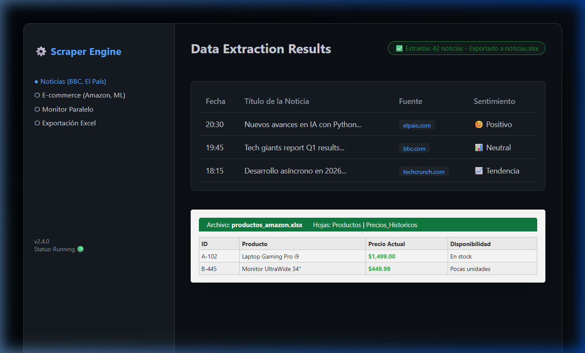
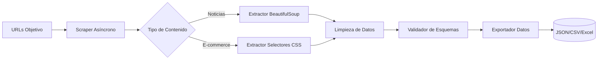

# 🕵️ Web Scraper Profesional (Async)



[](https://www.python.org/downloads/)
[](https://www.crummy.com/software/BeautifulSoup/)
[](https://www.python-httpx.org/)
[](https://opensource.org/licenses/MIT)

Sistema de extracción de datos asíncrono y modular diseñado para la recolección masiva de información web con alta eficiencia y respeto a las políticas de los servidores.

## 🌟 Showcase del Proyecto

Este scraper va más allá de un simple script de extracción:
*   **Arquitectura Asíncrona:** Utiliza `httpx` y `asyncio` para realizar múltiples peticiones en paralelo, optimizando el tiempo de ejecución.
*   **Monitor de E-commerce:** Sistema especializado para seguir variaciones de precios en tiempo real.
*   **Exportador Multi-formato:** Salida estructurada a JSON, CSV y Excel profesional.
*   **Ética de Scraping:** Implementa rotación de User-Agents y retardos inteligentes (Rate Limiting).

## 🏗️ Pipeline de Extracción de Datos



## ✨ Características Técnicas

| Módulo | Implementación | Ventaja Competitiva |
|--------|----------------|---------------------|
| **Concurrencia** | `asyncio.gather()` | Procesamiento de 100+ páginas en segundos. |
| **Parsing** | BeautifulSoup4 (LXML) | Extracción precisa incluso en HTML complejo. |
| **Exportación** | Clase `ExportadorDatos` | Entrega de resultados listos para análisis. |
| **Configuración** | `scraper_config.json` | Fácil de adaptar a nuevos sitios sin cambiar código. |

## 🛠️ Stack Tecnológico

- **LenguajeCore:** Python 3.9+
- **HTTP Client:** Httpx (Async)
- **HTML Parser:** BeautifulSoup4
- **Excel Engine:** openpyxl
- **Logger:** Logging modular para auditoría de procesos

## 🚀 Instalación y Ejecución

### 1. Preparación
```bash
# Entrar al directorio
cd scraper-profesional

# Instalar dependencias
pip install -r requirements.txt
```

### 2. Uso Rápido
```bash
# Ejecutar el script principal
python scraper.py
```
*Los resultados se almacenarán automáticamente en la carpeta `scraping_resultados/`.*

## 📋 Ejemplo de Implementación

```python
from scraper import ScraperNoticias, ExportadorDatos
import asyncio

async def main():
    # 1. Inicializar
    scraper = ScraperNoticias()
    
    # 2. Extraer noticias en paralelo
    noticias = await scraper.extraer_noticias("https://elpais.com/tecnologia/")
    
    # 3. Exportar resultado profesional
    ExportadorDatos.a_excel(noticias, "monitor_tecnologia")
    await scraper.cerrar()

if __name__ == "__main__":
    asyncio.run(main())
```

---

> [!TIP]
> **Potencial de Negocio:** Este sistema es ideal para herramientas de SEO, monitoreo de marcas, investigación de mercado y automatización de contenidos periodísticos.

**Diseñado para la eficiencia y la escalabilidad.**